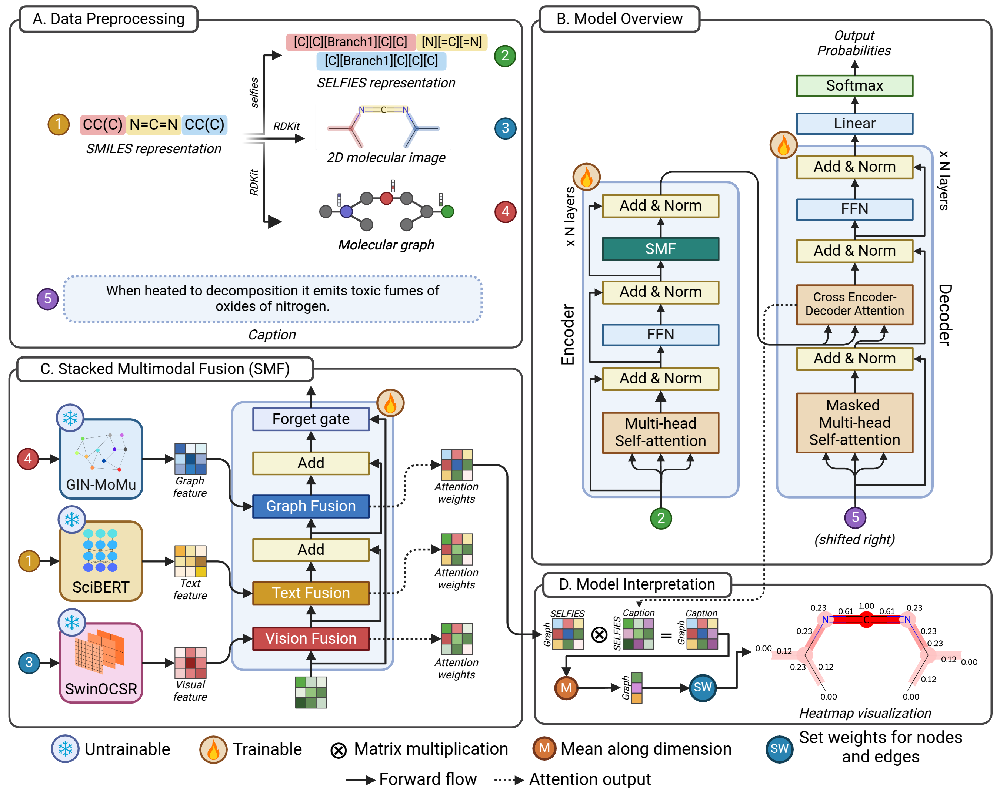
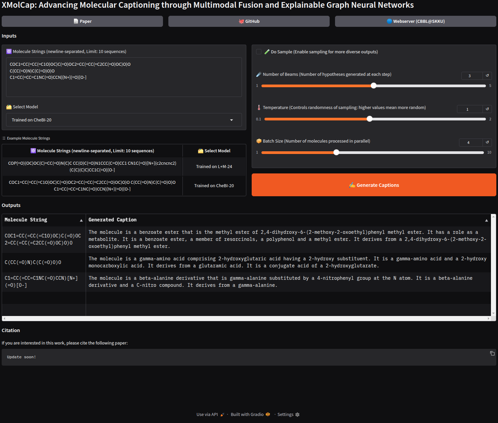

<h1 align="center">XMolCap</h1>
<p align="center"><a href="https://doi.org/10.1109/JBHI.2025.3572910">📝 Paper</a> | <a href="#3-benchmark-datasets">🤗 Benchmark datasets</a> | <a href="https://1drv.ms/f/c/fa72f5f3c0e55162/EhdZirq68n5IpLsXZfioaJEBZCv7gJD0zqtQuG6RVL23rQ?e=hEx9lg">🚩 Checkpoints</a> | <a href="#5-application">⚙️ Application</a> | <a href="#citation">📚 Cite our paper!</a></p>

The official implementation of manuscript **"XMolCap: Advancing Molecular Captioning through Multimodal Fusion and Explainable Graph Neural Networks"**

## Abstract
> Large language models (LLMs) have significantly advanced computational biology by enabling the integration of molecular, protein, and natural language data to accelerate drug discovery. However, existing molecular captioning approaches often underutilize diverse molecular modalities and lack interpretability. In this study, we introduce XMolCap, a novel explainable molecular captioning framework that integrates molecular images, SMILES strings, and graph-based structures through a stacked multimodal fusion mechanism. The framework is built upon a BioT5-based encoder-decoder architecture, which serves as the backbone for extracting feature representations from SELFIES. By leveraging specialized models such as SwinOCSR, SciBERT, and GIN-MoMu, XMolCap effectively captures complementary information from each modality. Our model not only achieves state-of-the-art performance on two benchmark datasets (L+M-24 and ChEBI-20), outperforming several strong baselines, but also provides detailed, functional group-aware, and property-specific explanations through graph-based interpretation. XMolCap is publicly available at https://github.com/cbbl-skku-org/XMolCap/ for reproducibility and local deployment. We believe it holds strong potential for clinical and pharmaceutical applications by generating accurate, interpretable molecular descriptions that deepen our understanding of molecular properties and interactions.



## News
- `2025.05.16`: Happy to announce that our manuscript was accepted 🎉🎉🎉 (DOI: [10.1109/JBHI.2025.3572910](https://doi.org/10.1109/JBHI.2025.3572910)).
- `2025.02.14`: XMolCap was considered for major revision.
- `2024.12.03`: Manuscript was submitted to IEEE Journal of Biomedical and Health Informatics (IEEE JBHI).

## How to use

### 1. Environment preparation
Create an environment using Miniconda or Conda:
```zsh
conda create -n XMolCap python=3.10
conda activate XMolCap
```

After cloning the repo, run the following command to install required packages:
```zsh
# installing pytorch, recommend vervion 2.1.2 or above, you should change cuda version based on your GPU devices
pip install torch==2.1.2 torchvision==0.16.2 torchaudio==2.1.2 --index-url https://download.pytorch.org/whl/cu121

# installing additional packages
pip install -r requirements.txt

# install additional packages for Torch Geometric, cuda version should match with torch's cuda version
pip install pyg_lib torch_scatter torch_sparse torch_cluster torch_spline_conv -f https://data.pyg.org/whl/torch-2.1.2+cu121.html
```

### 2. Pretrained models
We use these pretrained models for fine-tuning:

- BioT5: [HuggingFace](https://huggingface.co/QizhiPei/biot5-base)
- SwinOCSR: [Kaggle](https://www.kaggle.com/datasets/gogogogo11/moedel)
- SciBERT: [HuggingFace](https://huggingface.co/allenai/scibert_scivocab_uncased)
- GIN-MoMu: [GitHub](https://github.com/ddz16/MoMu)

Except for BioT5 and SciBERT which are automatically downloaded when you start training or evaluating, you need to prepare SwinOCSR and GIN-MoMu's checkpoint from the above link, then put it into `weights/`.

### 3. Benchmark datasets
- LPM-24: [HuggingFace](https://huggingface.co/datasets/duongttr/LPM-24-extend)
- CheBI-20: [HuggingFace](https://huggingface.co/datasets/duongttr/chebi-20-new)

Because the datasets are automatically downloaded from HuggingFace, please send access request and login by following command:
```zsh
huggingface-cli login --token '<hf_token>'
```

### 3. Training model

#### LPM-24 dataset:

```zsh
python train.py --epochs 20 --batch_size 8 \
                --grad_accum 32 --warmup_ratio 0.05 --lr 3e-5 --num_devices 4 \
                --dataset_name lpm-24 --model_config src/configs/config_lpm24_train.yaml \ 
                --cuda
```

#### CheBI-20 dataset:
```zsh
python train.py --epochs 50 --batch_size 8 \
                --grad_accum 32 --warmup_ratio 0.04 --lr 1e-4 --num_devices 4 \
                --dataset_name chebi-20 --model_config src/configs/config_chebi20_train.yaml \ 
                --cuda
```

### 4. Evaluating model
#### Main checkpoints
| Checkpoints | Download link |
|---|---|
|LPM-24 (SMILES off, Center blocks) | [OneDrive](https://1drv.ms/u/c/fa72f5f3c0e55162/EQ69WtC5yCVIoD_5MvC-5WsBQjQ3JP5Y9UArGdkxIoYQog?e=nOHIKK) |
|CheBI-20 (All modals, Center blocks) | [OneDrive](https://1drv.ms/u/c/fa72f5f3c0e55162/EZVvB_qshgNHgA2L_yecyM4B5DRUOGwCkFZlWtRp0jOc5g?e=U0XVBb) |
#### Ablation studies' checkpoints
| Checkpoints | Download link |
|---|---|
|LPM-24 (Graph off, Center blocks)| [OneDrive](https://1drv.ms/u/c/fa72f5f3c0e55162/EcqTtyb_ROlGkm_AEeRnxoQB8nq-0ifmdHlOKGFZ59WkSQ?e=dsoUI9) |
|LPM-24 (Vison off, Center blocks)| [OneDrive](https://1drv.ms/u/c/fa72f5f3c0e55162/EcmEuIbEgytFl_x8iG92Q3cBzmGMlZCpPBOA3Unl_cRldQ?e=z5UFOw) |
|LPM-24 (All modals, First blocks)| [OneDrive](https://1drv.ms/u/c/fa72f5f3c0e55162/EW-oDiacHIFKlIhSpE-epe8Bp5T-4_r_9NdCUnr2YeF1ew?e=3YH6Yg) |
|LPM-24 (All modals, Center blocks)| [OneDrive](https://1drv.ms/u/c/fa72f5f3c0e55162/EXTkjXhk8wtGniPyZINgC7UBauqea127hr4fGs0Z73TD8Q?e=uLbiZg) |
|LPM-24 (All modals, Last blocks)| [OneDrive](https://1drv.ms/u/c/fa72f5f3c0e55162/EdLitFMoY3pKg7YZPbIyPNwB0HWTeKHG1i-4u2O0-EX4Ig?e=CfgxPX) |
|LPM-24 (All modals, Full blocks)| [OneDrive](https://1drv.ms/u/c/fa72f5f3c0e55162/ETJFHqC3wvtLt5Zanf51i_QByehGTAlzMPUTHzH7WfCfRw?e=Ys2UGM) |

#### Evaluate on LPM-24
```zsh
python eval.py --dataset_name lpm-24 \
               --model_config src/configs/config_lpm24_train.yaml \
               --checkpoint_path path/to/ckpt \
               --cuda
```

#### Evaluate on CheBI-20
```zsh
python eval.py --dataset_name chebi-20 \
               --model_config src/configs/config_chebi20_train.yaml \
               --checkpoint_path path/to/ckpt \
               --cuda
```

### 5. Application
#### Start the app
You can interact with the model through a user interface by running the following command:

```zsh
python app.py
```

The terminal will provide a local URL for testing and a public URL for global sharing.

### Preview


## Citation
If you are interested in my paper, please cite:
```
@ARTICLE{11012653,
  author={Tran, Duong Thanh and Nguyen, Nguyen Doan Hieu and Pham, Nhat Truong and Rakkiyappan, Rajan and Karki, Rajendra and Manavalan, Balachandran},
  journal={IEEE Journal of Biomedical and Health Informatics}, 
  title={XMolCap: Advancing Molecular Captioning through Multimodal Fusion and Explainable Graph Neural Networks}, 
  year={2025},
  volume={},
  number={},
  pages={1-12},
  keywords={Biological system modeling;Feature extraction;Chemicals;Bioinformatics;Accuracy;Training;Data models;Data mining;Transformers;Encoding;Explainable artificial intelligence;graph neural networks;language and molecules;large language models;molecular captioning;model interpretation;multimodal fusion},
  doi={10.1109/JBHI.2025.3572910}}
```